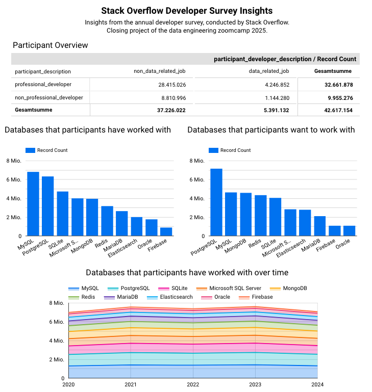
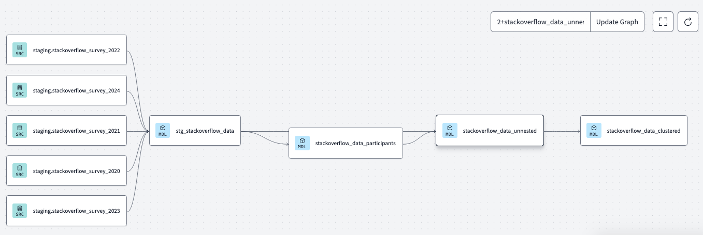

# Stack Overflow Survey - Insights

A small project that loads, extracts, transforms and visualizes data from the Stack Overflow survey using batchprocessing in GCP. 

Closing project of the [data engineering zoomcamp 2025](https://github.com/DataTalksClub/data-engineering-zoomcamp/tree/main).

# Preview

# Problem-Description

As both a data engineer and former software developer, I've always been drawn to StackOverflow surveys, a key resource in the programming community.
Nevertheless, the dataset presents challenges: questions and column names often change annually, and certain questions may appear or vanish over the years.
This makes analyzing tech-industry trends difficult.
However, when concentrating on specific questions (e.g., *How did the usage of speciic databases changed over the years?*), a union of the data between the years can be achieved.
This is what has been conducted in this project.

# Techstack

- *Terraform*: Setting up the IaC
- *Kastra*: Orchestrate a Pipeline for processing loading data into a datalake and then into a data warehouse
- *DBT/BigQuery*: Transforming the data in the data warehouse: prepare and cluster it for the dashboard
- *Looker Studio (former Google Data Studio)*: Building a dashboard to visualize the data

# Technical Details

## 0. Data-Source
https://survey.stackoverflow.co/

Sadly, it does not seem to be possible to gather the data automatically with a script due to changing link structures.

Examples:
- https://info.stackoverflowsolutions.com/rs/719-EMH-566/images/stack-overflow-developer-survey-2022.zip
- https://survey.stackoverflow.co/datasets/stack-overflow-developer-survey-2016.zip

Therefore, downloading the zip-files manually in every new year seems to be mandatory.

The .zip files are located in "00_data".

## 1. IaC with Terraform

### Description
- creating a databucket
- creating a dataset (for the initial tables from Kestra)
- creating a dataset (staging - for dbt-transformations)
- creating a dataset (production - for dbt-transformations)

### Usage
- create service-account in GCP and export credentials as JSON
- adjust path to this JSON in main.tf
- adjust project-name and region

- run "terraform init", "terraform plan", "terraform apply"

## 2. Workflow-Orchestration and Data-Ingestion with Kaestra

### Description
- setting up key-value-variables for GCP in Kaestra
- extract the .zip files (located in "00_data") and upload the .csv files to GCS in batches
- create external tables and non-external tables in BigQuery

### Usage
- execute "docker compose up -d" to run kaestra (in the docker-compose, the local folder with the zip-files is mapped as value so Kestra can find the local files)
- open "http://localhost:8080" 
- import the flow "01_key_values.yaml" execute it to set the credentials
    - NOTE: copy the credentials of the GCP service account from the JSON to 01_key_values.yaml
- import and execute either
    - "02_stackoverlow_ingestion_with_inputs.yaml" to execute the ingestion for one year
    - "03_stackoverlow_ingestion_scheduled.yaml", where all years can be executed at once using the backfill-function (start: "2020-01-01 00:00:00", end: "2025-01-01 00:00:00")

## 3. Transformations with DBT

### Description
- see lineage for overview

#### Models
- stg_stackoverflow_data.sql
    - union of the tables of four years with selected columns and renaming
- stackoverflow_data_participants.sql
    - distincting participants in professional/non-professional developers and in data-related or non-data-related jobs
- stackoverflow_data_unnested.sql
    - unnesting of nested columns "DatabaseHaveWorkedWith" and "DatabaseWandToWorkWith" and joining with stackoverflow_data_participants
- stackoverflow_data_clustered.sql
    - final data table for the front-end, partitioned by year and clustered by "participant_description" and "participant_developer_description"

Partitioning by year optimizes query performance for time-based filtering, while clustering by "participant_description" and "participant_developer_description" enhances efficiency when filtering or sorting by these columns, both improving data retrieval speed for the frontend.

### Usage
- set up DBT with BigQuery-connection, Repository-connection, and, if desired, multiple environments
- execute dbt-build in development-env and later in production-env

## 4. Building dashboard with Looker Studio

https://lookerstudio.google.com/reporting/7e7fd48b-3d32-425b-a129-ae39d3b3e7d4

### Description
- 1 x pivot-table: shows the distribution of professional/non-professional developers and data-related/non-data-related jobs
- 2 x acid diagram: shows the databases that most of the participants have worked with / want to work with
- 1 x area diagram: shows the distribution of databases that participants have worked with over the years

- Note: Only the 10 most used databases are shown for a better overview

- Filters: In the dashboard, it is possible to filter using
    - years
    - professional/non-professional developers
    - data-related/non-data-related jobs

### Reproduction
- I don't think it is possible to place the dashboard in this repository since it is a no-code solution
- However, the dashboard can be opened by using the [link](https://lookerstudio.google.com/reporting/7e7fd48b-3d32-425b-a129-ae39d3b3e7d40)

- Reproducing this visualisation could be done like this:
    - go to [lookerstudio.google.com](https://lookerstudio.google.com/)
    - create a connection to the BigQuery table "stackoverflow_data_clustered"
    - create a new report
    - create the dashboards mainly via drag and drop

